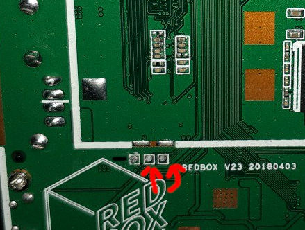

<b>[redboxmini3-armbian]</b>

(All technical information about the REDBOX MINI 3 device, including the ability to build the Linux ARMBIAN distribution.)

<b><i>Important: The data in this repository is experimental and may contain errors. This repository was developed primarily for devices with V3 specifications. Devices with less RAM and permanent memory, or different processors, are not currently supported.</b></i>

<b><i>Important: Users are solely responsible for making decisions about using this data and for collecting images to run third-party software.</b></i>

## Board versions

### * V3

<b></img></img></img></b>

<b>CPU:</b> Allwinner H3 (armvh7, x4, 0.2Ghz-1.01Ghz)

<b>MEM:</b> 1GB (DDR3)

<b>Eth:</b> Internal (100mbit)

<b>WI-FI:</b> XR819 (was not considered)

<b>USB:</b> x2 2.0, (works, presumably the board has contacts for additional USB, This version does not have USB power management (it is always on))

<b>EMMC:</b> FORESEE MCEMAM6G-08G (booting from it works and tested on uboot-orange-pi-pc-plus)

<b>GPIO:</b> LED_PWR (1c20800, 15-PA15), LED_STATUS (1f02c00, 362-PL10), IR (1f02c00, 363-PL11), KEY_RESET (1f02c00, 355-PL3) (On this board you can get absolutely any gpio that is available on allwinner h3 (I’m just giving a list of those pins that you can get without much effort).)

## UART (DEBUG)

#### * V3 (115200, 3.3, image for allwinner h3 is identical to allwinner h5)

</img>

## Status

Fully working machine (without wifi chip) based on x32 armbian, surprisingly much cooler than h5 version. Performance is more than enough for undemanding devices.

## Quick Answers to Questions

#### • Will there be support for 1.2/1.5 GHz processor frequencies?

These devices use a constant 1.1V voltage, which cannot be adjusted. This means that higher processor frequencies like 1.2/1.5 GHz are not achievable. 

#### • Will there be WI-FI support?

WI-FI support is not currently available due to difficulties in obtaining compatible driver code. The chip itself is not very efficient for wireless communication, so wired connections (Ethernet or USB Wi-Fi) are preferred.

#### • I2C support?

I2C support is not available, as all I2C buses in the device tree are currently disabled. 

## License

All rights reserved.
