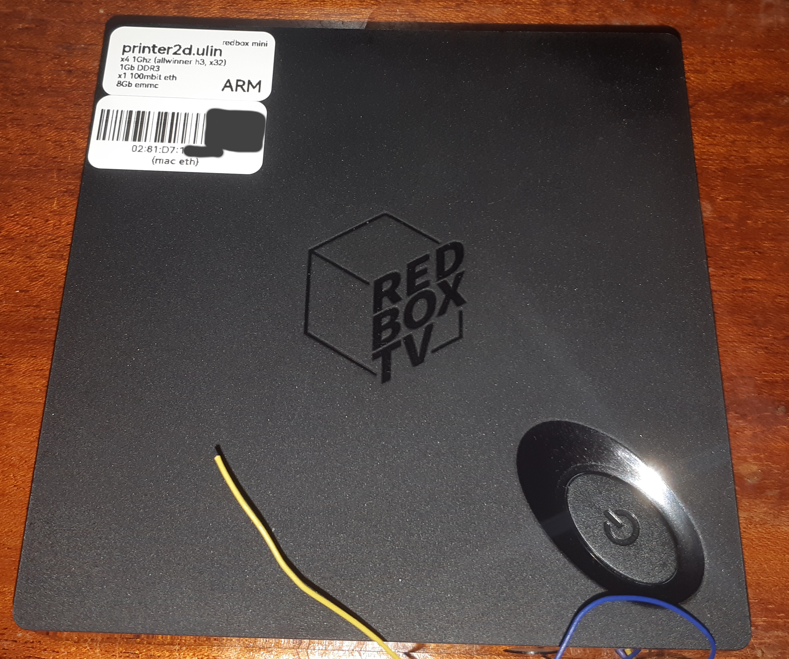
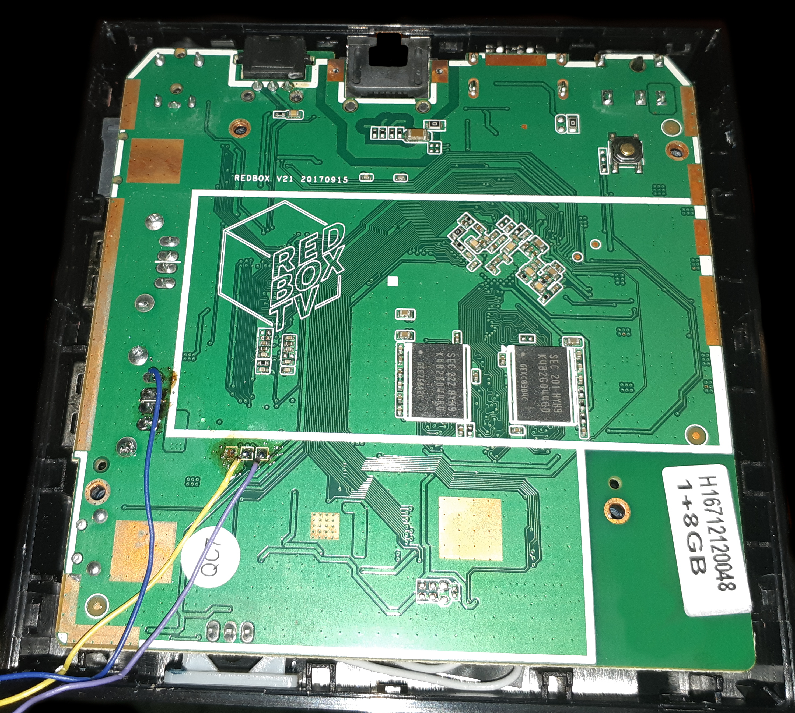
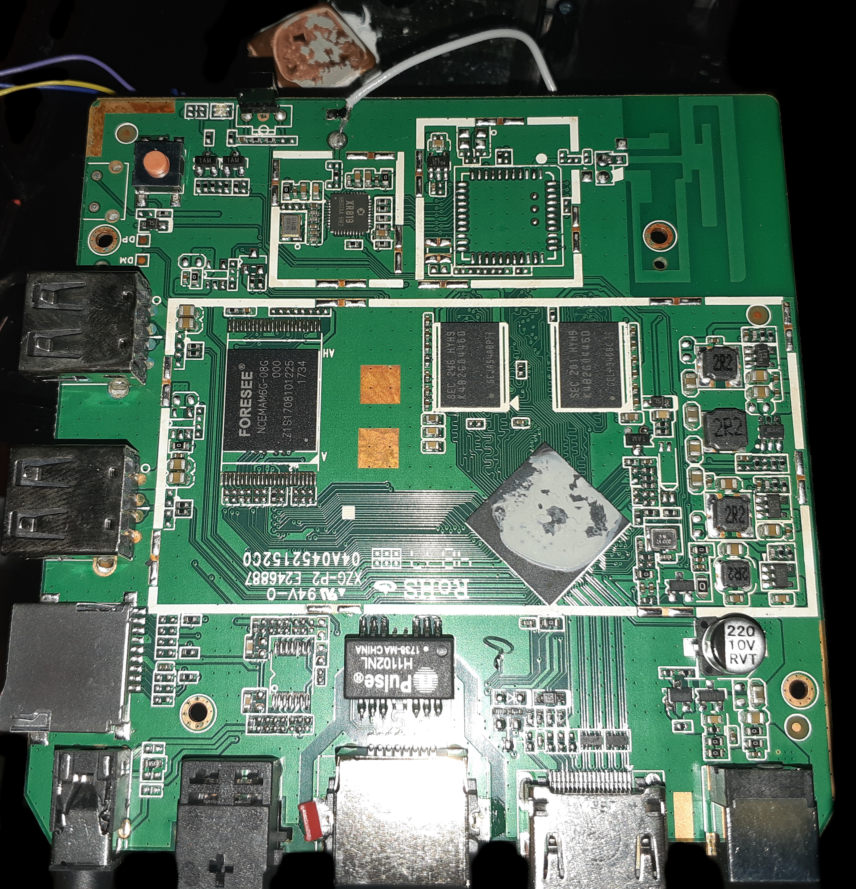
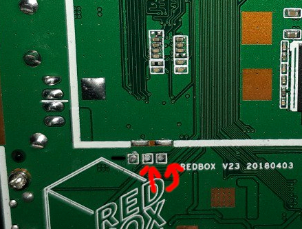

<div id="header" align="center">

<b>[redboxmini3-armbian]</b>

(All technical information about the REDBOX MINI 3 device, including the ability to build the Linux ARMBIAN distribution.)
</div>


## Disclaimer
| :boom: Disclaimer          |
|:---------------------------|
|  :warning:  The data in this repository is experimental and may contain errors. This repository was developed primarily for devices with V3 specifications. Devices with less RAM and permanent memory, or different processors, are not currently supported. |
|  :warning:  <b>You can do what is described here only at your own risk.</b> Damage to your computer may occur at any stage of these procedures. |
|  :warning:  All rights reserved. |

## Board versions

### * V3

<b></img></img></img></b>

| name | value |
| ---- | ----- |
| CPU | Allwinner H3 (armvh7, x4, 0.2Ghz-1.01Ghz) |
| MEM | 1GB (DDR3, ~624Mhz) |
| Eth | Internal (100mbit) |
| WI-FI | XR819 |
| EMMC | FORESEE MCEMAM6G-08G (booting from it works and tested on uboot-orange-pi-pc-plus) |
| USB | x2 2.0, (works, presumably the board has contacts for additional USB, This version does not have USB power management (it is always on)) |
| GPIO | LED_PWR (1c20800, 15-PA15), LED_STATUS (1f02c00, 362-PL10), IR (1f02c00, 363-PL11), KEY_RESET (1f02c00, 355-PL3) |

## UART (DEBUG)

#### * V3 (115200, 3.3)

</img>

## Status
<details open> 
  <summary><b># V2 (stable)</b></summary>
  <div>&nbsp;&nbsp;&nbsp;-&nbsp;Fully working machine based on x32 armbian, surprisingly much cooler than h5 version. Performance is more than enough for undemanding devices.</div>
</details>

<details open> 
  <summary><b># V1 (stable)</b></summary>
  <div>&nbsp;&nbsp;&nbsp;-&nbsp;Fully working machine (without wifi chip) based on x32 armbian, surprisingly much cooler than h5 version. Performance is more than enough for undemanding devices.</div>
</details>


## Quick Answers to Questions

<details open> 
  <summary><b># Will there be support for 1.2/1.5 GHz processor frequencies?</b></summary>
  <div>&nbsp;&nbsp;&nbsp;-&nbsp;These devices use a constant 1.1V voltage, which cannot be adjusted. This means that higher processor frequencies like 1.2/1.5 GHz are not achievable.</div>
</details>

<details> 
  <summary><b># What driver can I use to make Wi-Fi work?</b></summary>
  <div>&nbsp;&nbsp;&nbsp;-&nbsp;Assemble and connect the module: https://github.com/fifteenhex/xradio
    
  example_how_to_assemble_and_install:
    ```
    make ARCH=arm -C /usr/src/linux-headers-6.12.43-current-sunxi/ M=$PWD modules;
    make ARCH=arm -C /usr/src/linux-headers-6.12.43-current-sunxi/ M=$PWD INSTALL_MOD_PATH=/usr modules_install;
    ```
    
  Use dtb version V2 from this repository.
  </div>
</details>
