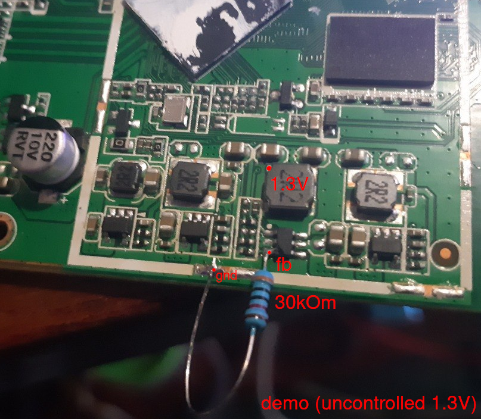
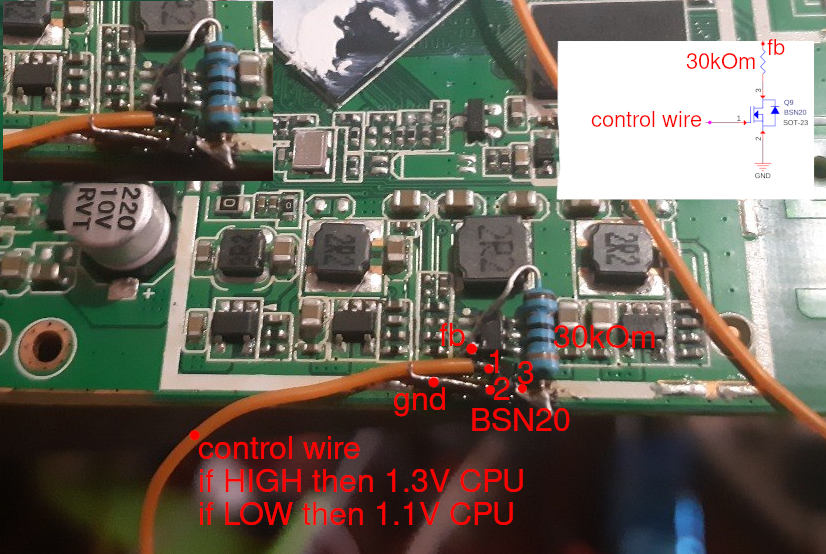
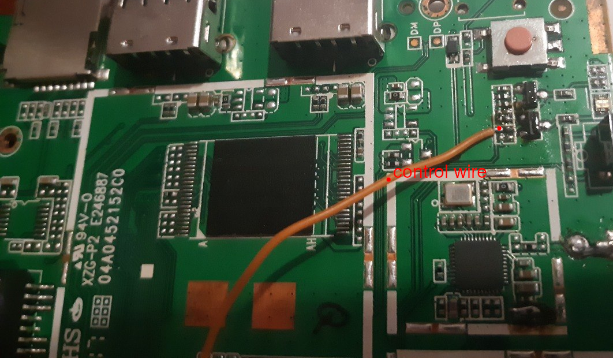

### Turbo Mode

This hardware modification enables the single-board computer to operate at a clock speed of 1.2 GHz, while retaining the capability to dynamically scale down to standard power-saving profiles (400 MHz – 1.0 GHz). 

This solution is designed for stable operation and does not involve extreme overclocking. The provided configurations can also serve as a baseline for experimenting with custom frequency and voltage profiles. 

**Important:** Running at 1.2 GHz with 1.3V is safe and well within the standard operating limits of this SoC. Under this load, passive cooling remains sufficient to maintain stable temperatures. 

## Fixed 1.2 GHz Operation (Without Power-Saving)

An alternative, simplified modification to lock the CPU at a constant 1.2 GHz without dynamic voltage scaling: 

1. Solder a **30 kOm resistor** between the ground plane (**GND**) and the feedback loop (**FB**) of the power regulator.
2. Compile and apply the DeviceTree with turbo mode enabled (make turbomod).

**Technical Limitation:** The DeviceTree governor will only manage the CPU frequency. Dynamic 1.1V / 1.3V voltage switching is not available in this configuration, but the processor will consistently achieve the targeted 1.2 GHz frequency. 

</img>

## Full Dynamic Power Management (1.1V / 1.3V)

This hardware setup enables fully dynamic voltage scaling. The DeviceTree manages the voltage state via the status LED line: when turbo mode is triggered, the blue LED illuminates and voltage increases to 1.3V. In power-saving states, the LED turns off and the voltage drops back to 1.1V. 

### Required Components

* **N-Channel MOSFET:** BSN20 (A common BSS138, often found on logic level converters, can be used as a direct alternative and is fully sufficient for this circuit).
* **Resistor:** 30 kOm (An SMD resistor is recommended, though a standard 1% metal-film resistor like MF-25 will work perfectly).
* **Wiring:** Fine enamel/wrapping wire for the control line and a standard jumper/wire for the ground connection.

### Assembly Instructions

1. Solder one side of the 30 kOm resistor to the feedback (**FB**) line of the voltage regulator.
2. Solder the remaining lead of this resistor to the **Drain (Pin 3)** of the MOSFET.
3. Connect the control wire to the **Gate (Pin 1)** of the MOSFET.
4. Connect the **Source (Pin 2)** of the MOSFET to the ground plane (**GND**).
5. Solder the opposite end of the control wire to the current-limiting resistor of the blue status LED (on the SoC control side).

*Note: Component placement is flexible. You may orient and position the transistor and resistor in any layout that fits your specific board space.*

</img>

</img>

