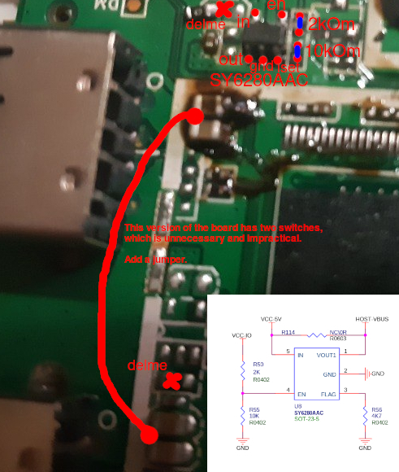

### USB Power Management Modification (usbpowermode)

This modification introduces hardware control over the USB VBUS power line. It is essential for the stable operation of client devices that rely on the presence or absence of 5V (or VBUS sensing) to detect connection, disconnection, or reconnection events. Without this control, client devices cannot accurately detect a hot-plug or reset state during the single-board computer's boot or reboot sequence. 

No DeviceTree modifications are required. Both the standard and turbo-mode DeviceTree versions natively support USB power enablement (EN), as the layout for this circuitry exists on the PCB but was left unpopulated by the manufacturer. 

### Bill of Materials (BOM)

* **Power Distribution Switch:** SY6280AAC (SOT-23-5 package)
* **Resistors:** 1x 2 kOm resistor, 1x 10 kOm resistor
* **Jumper Wire:** Small wire for linking capacitor pads

### Step-by-Step Installation

1. Remove the two **0 resistors** (jumpers) that bypass the 5V line.
2. Solder the **SY6280AAC** IC onto its designated footprint on the PCB.
3. Populate the missing resistor pads: place the **2 kOm resistor** in the upper slot and the **10 kΩ resistor** in the slot below it.
4. Bridge the capacitor group pads with a **jumper wire**. This is necessary because the board layout originally allocated an individual SY6280AAC per USB port.

</img>

### Verification and Testing

To verify the modification, you can use either of the following methods: 

* **Visual Method:** Insert a USB flash drive equipped with an LED indicator. The LED must remain completely off until the Linux kernel begins loading.
* **Command Line Method:** Boot into the U-Boot environment and manually cycle the power rail by toggling the **PL2** pin using the gpio toggle command.

